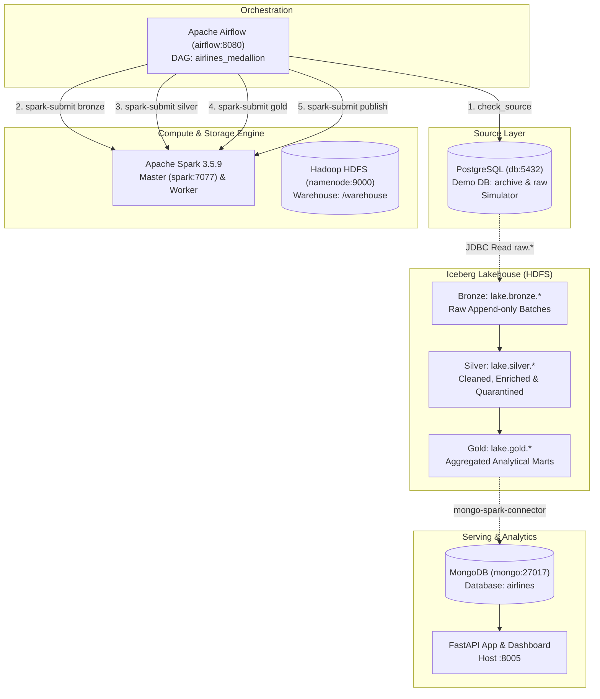

# KTDL-Group20 Airlines Lakehouse

A Medallion Lakehouse platform built with PostgreSQL, Apache Spark, Apache Iceberg, Hadoop HDFS, MongoDB, Apache Airflow, and FastAPI.

---

## Architecture
> 📘 **Detailed Technical Reference**: For complete technical specifications covering container topology, simulation mechanics, Iceberg layer transformations, and data engineering patterns, see [System Design & Dashboard Documentation](docs/SYSTEM_DESIGN_AND_DASHBOARD.md).


The system implements a Medallion Lakehouse architecture orchestrating data movement from a relational OLTP database through raw, curated, and analytical layers:



### Data Pipeline Overview

1. **Raw Source Data**: The official demo dump, already converted into 3 denormalized raw tables ([`source/build_raw.sql`](source/build_raw.sql)) and committed in [`source/data/raw/`](source/data/raw): `flight_seat_reservations` (one row per seat per flight + unseated bookings), `airport_sites`, `aircraft_seat_layouts`.
2. **Source & Simulation**: Postgres database `demo` with schema `archive` (full history of the 3 raw tables) and schema `raw` (the same tables as of a simulation cutoff, `raw.now()`).
3. **Orchestration**: Airflow standalone orchestrates the medallion pipeline DAG `airlines_medallion` (`check_source` → `bronze` → `silver` → `gold` → `publish`).
4. **Bronze Layer**: Appends a full snapshot of the 3 raw tables per run into Iceberg (`lake.bronze.*`), partitioned by ingest day and batch, recording the loaded cutoff in `lake.meta.watermarks`.
5. **Silver Layer**: Splits the 3 raw tables back into the 8 normalized entities (airports, aircrafts, seats, bookings, tickets, flights_enriched, ticket_flights, boarding_passes) with distinct-per-key extraction, PK merge, enrichment of flight durations/delays/routes, and quarantine of conflicting or invalid records into `lake.silver.quarantine`.
6. **Gold Layer**: Computes analytical marts with official domain metrics (revenue, Pareto share, flight occupancy, fleet utilization, route delays, delay heatmaps).
7. **Publish Layer**: Exports Gold marts to MongoDB collections with upsert and run-tracking metadata (`pipeline_runs`).
8. **Dashboard**: FastAPI service serving interactive dashboards (Leaflet route map, delay heatmaps, revenue charts) and JSON REST endpoints.

---

## Containers & Ports

All services join the shared external Docker network `ktdl-network`. Host ports and internal service ports are mapped as follows:

| Container | Host port | Internal port | Description |
|---|---|---|---|
| `db` (PostgreSQL 16) | 5432 | 5432 | Primary OLTP database (`demo` and `airflow` DBs) |
| `adminer` | 8082 | 8080 | Web UI for PostgreSQL database management |
| `mongo` (MongoDB 7.0) | _Not published_ | 27017 | Serving document store (`airlines` database) |
| `mongo-express` | 8081 | 8081 | Web UI for MongoDB database management |
| `namenode` (Hadoop 3.5.0) | 9870 | 9000 (RPC), 9870 (HTTP) | HDFS NameNode metadata server and web UI |
| `datanode` (Hadoop 3.5.0) | _Not published_ | 9864 (HTTP), 9866 (Data) | HDFS DataNode block storage |
| `spark` (Master 3.5.9) | 8080 | 7077 (RPC), 8080 (HTTP) | Apache Spark master node and cluster UI |
| `spark-worker` (Worker 3.5.9) | _Not published_ | 8081 (HTTP) | Apache Spark worker (2 cores, 2 GB RAM) |
| `airflow` (Airflow 2.10.5) | 8083 | 8080 (HTTP) | Airflow standalone (webserver, scheduler, triggerer) |
| `app` (FastAPI service-main) | 8005 | 8000 (HTTP) | Analytical API and interactive dashboard |

> **Security & Isolation Note**: Internal ports for `mongo` (27017), `spark:7077` (Spark RPC), and `namenode:9000` (HDFS RPC) are intentionally not published to the host to avoid host port collisions. They are reachable internally across services on `ktdl-network`.

---

## Run the Demo

Follow this step-by-step runbook to run the full end-to-end integration:

### 1. Start all infrastructure containers
```bash
./start-all.sh
```
This script ensures `ktdl-network` exists, boots all Docker Compose stacks, and verifies container-to-container connectivity.

### 2. Load the Postgres demo database
```bash
./source/load_dump.sh
```
Restores the committed raw dump (`source/data/raw/`) into schema `archive` of a fresh `demo` database, creates the empty `raw` schema, and populates initial simulation state.

### 3. Advance the simulation cutoff to 2017-06-15
```bash
./source/simulate.sh 2017-06-15
```
Populates the `raw` tables as of `2017-06-15`, printing table row counts and flight status distribution.

### 4. Trigger the medallion pipeline DAG
- **Via Web UI**: Open [http://localhost:8083](http://localhost:8083) (login: `admin` / `admin`), unpause and trigger `airlines_medallion`.
- **Via CLI**:
  ```bash
  docker compose -f airflow/docker-compose.dev.yaml exec airflow airflow dags trigger airlines_medallion
  ```
The DAG executes sequentially: `check_source` → `bronze` → `silver` → `gold` → `publish`.

### 5. View metrics on the dashboard
Open [http://localhost:8005](http://localhost:8005) to view:
- Route revenue and Pareto distribution
- Airport departure traffic and top route maps
- Delay heatmaps (Day of Week × Departure Hour)
- Aircraft fleet load factors and performance

> 📊 **Dashboard Guide & Analysis**: See [System Design & Dashboard: Section 4](docs/SYSTEM_DESIGN_AND_DASHBOARD.md#4-dashboard-walkthrough--business-intelligence) for an exhaustive breakdown of what evaluators see on each tab (Overview, Map, Delays, Revenue, Fleet, Pipeline), underlying business meaning, and official benchmark acceptance figures.

### 6. Repeat with subsequent cutoffs
Advance the cutoff to observe incremental processing:
```bash
./source/simulate.sh 2017-07-15
docker compose -f airflow/docker-compose.dev.yaml exec airflow airflow dags trigger airlines_medallion
```
And the final full cutoff:
```bash
./source/simulate.sh '2017-08-15 18:00:00+03'
docker compose -f airflow/docker-compose.dev.yaml exec airflow airflow dags trigger airlines_medallion
```

### 7. Stop infrastructure
```bash
./stop-all.sh
```

---

## Local Verification Checklist

Verify the following acceptance benchmarks locally after running the pipeline through the final cutoff (`2017-08-15 18:00:00+03`):

- **Data Integrity**:
  - All 3 tables in schema `raw` equal schema `archive` (`EXCEPT ALL` both ways returns 0 rows).
- **Flight Volume**:
  - Exactly **49,235** Arrived flights in the dataset.
  - **2,394** delayed flights (> 15 minutes departure delay).
- **Fleet Load Factor**:
  - Boeing 777-300 load factor ≈ **72.8%**.
  - Cessna 208 Caravan load factor ≈ **16.0%**.
- **Route Revenue & Pareto Distribution**:
  - Total revenue ≈ **47.0B RUB** across **457** revenue routes.
  - Top **39** routes account for **50%** of total revenue.
- **Delay Hotspots**:
  - Voronezh (VOZ) → Pulkovo (LED): **11.1%** delay rate over 90 arrived flights.

### System Requirements & Notes
- **Host Ports Free**: Ensure host ports `5432` (PostgreSQL), `8005` (FastAPI), `8080` (Spark UI), `8081` (Mongo Express), `8082` (Adminer), `8083` (Airflow), and `9870` (NameNode UI) are not bound by host processes before launching.
- **Memory**: Docker daemon should have at least **6–7 GB RAM** allocated for all services to operate reliably.
- **Dependency Management**: When updating dependencies in `service-main`, run `uv lock` inside `service-main` locally.
- **Raw Dump**: `source/data/raw/` is committed (about 242 MB of gzip parts). To regenerate it from the official dump, run `./source/export_raw_dump.sh` (see [source/README.md](source/README.md)).
- **PostgreSQL Initialization**: Postgres initialization scripts in `postgres/init/` (which pre-creates the `airflow` database) only execute when the database data directory is empty. When resetting the environment, remove the Postgres data volume (`docker volume rm postgres_postgres_data` or `docker compose ... down -v`) to ensure clean database initialization.
