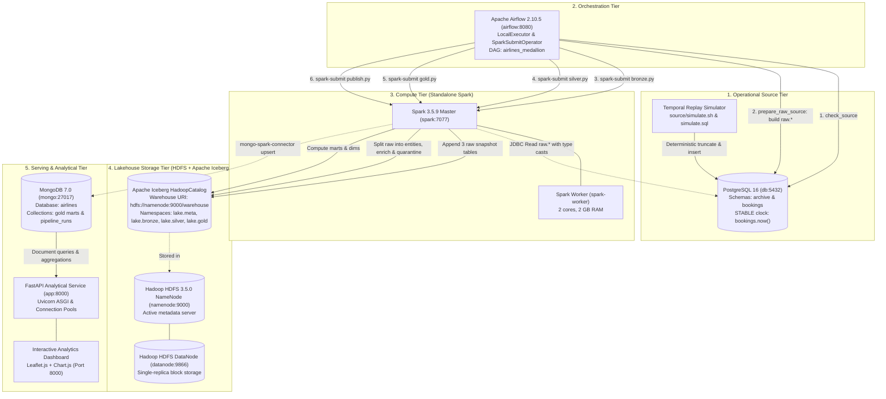

# Airlines Medallion Lakehouse: System Design & Analytical Dashboard

This document provides a comprehensive technical architecture and reference guide for the Airlines Medallion Lakehouse platform demonstrated by KTDL-Group20. It covers the multi-tier container topology, simulation mechanics, Lakehouse data pipeline (Bronze, Silver, Gold, Publish), and an in-depth walkthrough of the analytical dashboard and business intelligence metrics.

---

## Table of Contents

1. [Architecture & Topology](#1-architecture--topology)
   - [Core Components & Functional Roles](#core-components--functional-roles)
   - [Docker Network Topology (`ktdl-network`) & Port Allocation](#docker-network-topology-ktdl-network--port-allocation)
   - [Security & Isolation Rationale](#security--isolation-rationale)
2. [End-to-End Data Flow](#2-end-to-end-data-flow)
   - [Operational Source & Simulation Architecture](#operational-source--simulation-architecture)
   - [Airflow Medallion DAG Execution](#airflow-medallion-dag-execution)
   - [Serving Layer & FastAPI Ingestion](#serving-layer--fastapi-ingestion)
3. [Core Logic & Transformations](#3-core-logic--transformations)
   - [Deterministic Temporal Simulator](#deterministic-temporal-simulator)
   - [Bronze Ingestion & Watermarking](#bronze-ingestion--watermarking)
   - [Silver Cleansing, Quarantine & Enrichment](#silver-cleansing-quarantine--enrichment)
   - [Gold Analytical Marts & Industry Formulations](#gold-analytical-marts--industry-formulations)
   - [Publish Layer, PyMongo Maintenance & Lifecycle Hygiene](#publish-layer-pymongo-maintenance--lifecycle-hygiene)
4. [Dashboard Walkthrough & Business Intelligence](#4-dashboard-walkthrough--business-intelligence)
   - [Overview Tab (Executive KPIs)](#tab-1-overview--executive-kpis)
   - [Map Tab (Geospatial Network & Route Corridors)](#tab-2-map--geospatial-network--route-corridors)
   - [Delay Analysis Tab (Operational Heatmaps & Bottlenecks)](#tab-3-delay-analysis--operational-bottlenecks)
   - [Revenue Analysis Tab (Financial Concentration & Pareto Share)](#tab-4-revenue-analysis--financial-concentration)
   - [Fleet & Utilization Tab (Asset Efficiency & Seat Layouts)](#tab-5-fleet--utilization--asset-efficiency)
   - [Pipeline Health Tab (Medallion Observability & Auditing)](#tab-6-pipeline-health--data-engineering-observability)
   - [Benchmark Acceptance Metrics (`2017-08-15 18:00:00+03`)](#benchmark-acceptance-metrics-at-final-cutoff)

---

## 1. Architecture & Topology

### Core Components & Functional Roles

The platform follows a modernized Medallion Lakehouse paradigm, decoupling compute from storage, operational transactions from analytical serving, and streaming-like incremental batch processing from consumption interfaces:



1. **PostgreSQL 16 (`db`)**:
   - Acts as the operational OLTP database containing the standard PostgresPro Airlines demo schema.
   - Houses two distinct schemas: `archive` (immutable ground truth containing 3 months of historical airline activity) and `bookings` (the dynamic operational schema whose contents reflect an exact point-in-time snapshot governed by `bookings.now()`).
2. **Apache Airflow 2.10.5 (`airflow`)**:
   - Manages workflow orchestration through DAG `airlines_medallion`.
   - Utilizes `LocalExecutor` with an internal metadata store in PostgreSQL (`airflow` database).
   - Coordinates multi-stage batch tasks using `PythonOperator` for source pre-checks and `SparkSubmitOperator` for cluster dispatching.
3. **Apache Spark 3.5.9 (`spark`, `spark-worker`)**:
   - Distributed compute engine operating in standalone cluster mode (`spark://spark:7077`).
   - Executes heavy transformation pipelines using Spark SQL and DataFrame APIs.
   - Integrates `iceberg-spark-runtime-3.5_2.12:1.10.0`, `mongo-spark-connector_2.12:10.4.1`, and PostgreSQL JDBC driver `postgresql:42.7.4`.
4. **Hadoop HDFS 3.5.0 (`namenode`, `datanode`)**:
   - Persistent, distributed filesystem providing the physical storage backing Apache Iceberg tables at `hdfs://namenode:9000/warehouse`.
   - Single-replica topology tailored for isolated demonstration efficiency.
5. **Apache Iceberg Table Format**:
   - Open table format providing ACID transactional guarantees, hidden partitioning, schema evolution, partition evolution, snapshot isolation, and atomic `MERGE INTO` capabilities on top of Parquet files in HDFS.
6. **MongoDB 7.0 (`mongo`)**:
   - Low-latency document store serving pre-aggregated analytical gold marts, dimensions, and operational run telemetry to consuming applications.
7. **FastAPI Application & Dashboard (`app`)**:
   - Python asynchronous microservice serving REST APIs (`/api/marts/*`, `/api/summary`, `/api/airports`, `/api/routes`, `/api/runs`) and static assets (`dashboard.html`, `dashboard.js`, `dashboard.css`).
   - Renders interactive Leaflet maps and Chart.js visualizations directly in modern web browsers.

---

### Docker Network Topology (`ktdl-network`) & Port Allocation

All containers attach to an isolated user-defined Docker bridge network named `ktdl-network`. The routing table and port forwarding matrix are structured as follows:

| Container | Image | Host Port | Internal Port | Protocol / Purpose |
|---|---|---|---|---|
| `db` | `postgres:16-alpine` | _None_ | 5432 | PostgreSQL engine (demo OLTP & airflow metadata) |
| `adminer` | `adminer:latest` | **8082** | 8080 | PostgreSQL Administration UI |
| `mongo` | `mongo:7.0` | _None_ | 27017 | MongoDB document store engine |
| `mongo-express` | `mongo-express:latest` | **8081** | 8081 | MongoDB Administrative Web Console |
| `namenode` | `apache/hadoop:3.5.0` | **9870** | 9000 / 9870 | Port 9000: HDFS RPC protocol; Port 9870: WebHDFS UI |
| `datanode` | `apache/hadoop:3.5.0` | _None_ | 9866 / 9864 | Port 9866: HDFS Data transfer; Port 9864: DataNode HTTP |
| `spark` | `apache/spark:3.5.9` | **8080** | 7077 / 8080 | Port 7077: Spark Master RPC; Port 8080: Master Web UI |
| `spark-worker` | `apache/spark:3.5.9` | _None_ | 8081 | Spark Worker Web UI |
| `airflow` | `ktdl-airflow:2.10.5` | **8083** | 8080 | Airflow Standalone Webserver & Scheduler UI |
| `app` | `ktdl-service-main:latest` | **8000** | 8000 | FastAPI REST service & Interactive Dashboard |

---

### Security & Isolation Rationale

1. **Host Port Collisions & Zero-Exposure Policy**:
   - Standard infrastructure ports such as `5432` (PostgreSQL), `27017` (MongoDB), `7077` (Spark RPC), and `9000` (HDFS RPC) are intentionally **not exposed** to the host network interface.
   - This design guarantees that running the platform does not conflict with developers' existing local database or distributed systems installations.
   - Inter-service communication relies entirely on Docker internal DNS resolution within `ktdl-network`.
2. **Explicit Administrative Boundary**:
   - Administrative interfaces (`adminer` on port `8082`, `mongo-express` on port `8081`, Airflow UI on port `8083`, Spark UI on port `8080`, and NameNode UI on port `9870`) are mapped explicitly to non-standard, collision-free host ports.
3. **Data Plane vs. Control Plane Isolation**:
   - Spark executors run client-side driver sessions mapped through isolated container network bindings (`spark.driver.host=airflow`, `spark.driver.port=7078`, `spark.blockManager.port=7079`), isolating cluster block transfers from host traffic.

---

## 2. End-to-End Data Flow

The lifecycle of data through the Airlines Lakehouse spans five distinct chronological steps:

```
[Raw Demo SQL Dump]
       │
       ▼  (source/load_dump.sh)
[PostgreSQL: archive schema]
       │
       ▼  (source/simulate.sh <cutoff>)
[PostgreSQL: bookings schema] (Dynamic operational state up to bookings.now())
       │
       ├─────────────────────────────────────────────┐
       ▼ (1. check_source: PythonOperator)            │
[Airflow DAG: airlines_medallion]                    │
       │                                             │
       ▼ (2. prepare_raw_source: PythonOperator)       │
[PostgreSQL: raw schema (3 denormalized tables)] ◄───┘ (airline_data_source.sql)
       │
       ▼ (3. spark-submit bronze.py)
[HDFS: lake.bronze.* (3 raw snapshot Iceberg tables)]
       │
       ▼ (4. spark-submit silver.py)
[HDFS: lake.silver.* (MERGE INTO)] ──► [HDFS: lake.silver.quarantine] (Conflicting / malformed rows)
       │
       ▼ (5. spark-submit gold.py)
[HDFS: lake.gold.* (Analytical Marts & Dims)] ──► [Iceberg snapshot expiration]
       │
       ▼ (6. spark-submit publish.py)
[MongoDB: airlines database (replace upsert & index builds)]
       │
       ▼
[FastAPI REST API & Interactive UI Dashboard (:8000)]
```

### Operational Source & Simulation Architecture

1. **Initial Baseline Load**:
   - The script `source/load_dump.sh` downloads the PostgresPro Medium English Airlines dump (`demo-medium-en-20170815.sql`, ~1.5 GB uncompressed).
   - It restores the dump into database `demo` and renames the resulting operational schema to `archive`. The original `bookings.now()` timestamp is preserved in `archive.now()` (`2017-08-15 18:00:00+03`).
   - The script executes `source/schema.sql` to instantiate an identical set of 8 target tables inside schema `bookings`, creates performance indexes, and establishes a single-row state table `bookings.sim_state`.
2. **Dynamic Clock Function**:
   - `bookings.now()` is declared as a `STABLE` function:
     ```sql
     CREATE OR REPLACE FUNCTION bookings.now()
     RETURNS timestamptz LANGUAGE sql STABLE AS $$
         SELECT cutoff FROM bookings.sim_state LIMIT 1;
     $$;
     ```
   - Because it is marked `STABLE` rather than `IMMUTABLE`, PostgreSQL query planners do not prematurely fold constant values across query runs, yet optimizer passes can leverage stable guarantees within a single query execution.
   - `ALTER DATABASE demo SET search_path = bookings, public;` ensures that unqualified queries issued by Spark JDBC automatically target the active simulated state.

### Airflow Medallion DAG Execution

The DAG `airlines_medallion` is triggered on-demand without an automatic cron schedule (`schedule=None`), matching data engineering simulation runs:

1. **`check_source` (`PythonOperator`)**:
   - Connects directly to PostgreSQL `demo` database via `psycopg2`.
   - Executes `SELECT bookings.now() AS cutoff, count(*) AS cnt FROM bookings.bookings;`.
   - Validates that the operational database is reachable, non-empty, and returns the active cutoff timestamp string (e.g. `'2017-08-15 18:00:00+00'`), passing it down the pipeline via Airflow XCom.
2. **`prepare_raw_source` (`PythonOperator`)**:
   - Executes `/opt/pipeline/sql/bronze/airline_data_source.sql` via `psycopg2` to rebuild `raw.flight_seat_reservations`, `raw.airport_sites` and `raw.aircraft_seat_layouts` from the simulated `bookings` schema, and asserts the script's validation queries.
3. **`bronze` (`SparkSubmitOperator`)**:
   - Submits `/opt/pipeline/bronze.py` with parameter `--run-id <sanitized run_id>` to Spark master `spark://spark:7077`.
   - Reads the 3 raw tables via JDBC and appends full snapshots into Iceberg bronze tables.
4. **`silver` (`SparkSubmitOperator`)**:
   - Submits `/opt/pipeline/silver.py`.
   - Reads the current Bronze batch (`WHERE _batch_id = '${run_id}'`), splits the raw rows back into the 8 entities, executes conflict and business validation, reroutes invalid records into `lake.silver.quarantine`, and merges clean records into curated Silver Iceberg tables.
5. **`gold` (`SparkSubmitOperator`)**:
   - Submits `/opt/pipeline/gold.py`.
   - Aggregates Silver fact and dimension tables into analytical marts and dimension tables.
   - Executes Iceberg snapshot expiration (`CALL lake.system.expire_snapshots(...)`) to maintain clean storage bounds.
6. **`publish` (`SparkSubmitOperator`)**:
   - Submits `/opt/pipeline/publish.py`.
   - Synchronizes Gold marts into MongoDB collections using the Mongo-Spark Connector (`replace` upsert strategy).
   - Computes lineage and row-count metrics across all layers, recording a structured document in `pipeline_runs`.
   - PyMongo driver establishes auxiliary compound indexes on MongoDB collections.
7. **Failure Callback (`on_failure_callback`)**:
   - If any operator fails, the DAG-level callback instantiates a PyMongo connection to record a `pipeline_runs` document with `status: "failed"` and timestamps, ensuring dashboard observability even during outages.

### Serving Layer & FastAPI Ingestion

1. **Decoupled Analytics Serving**:
   - The FastAPI backend does not query Spark or HDFS directly at request time. This shields analytical users from Spark cluster latency.
   - All client queries hit MongoDB indexed collections (`gold_route_revenue`, `gold_route_pareto`, `gold_fleet`, `gold_delay_heatmap`, `gold_delay_by_aircraft`, `gold_delay_by_route`, `dim_airports`, `dim_routes`, and `pipeline_runs`).
2. **Client-Side Rendering**:
   - Browser clients load `dashboard.html`, which fetches pre-computed marts through FastAPI `/api/marts/*` and `/api/summary` endpoints, rendering charts asynchronously without server-side template blocking.

---

## 3. Core Logic & Transformations

### Deterministic Temporal Simulator

The simulator (`source/simulate.sql`, orchestrated via `source/simulate.sh <cutoff>`) enforces business realism during time progression. It operates in a single atomic transaction (`BEGIN ... COMMIT`) configured with `SET LOCAL work_mem = '256MB'`.

1. **Truncation & Dependency Ordering**:
   - All 8 operational tables in schema `bookings` are truncated in reverse foreign-key dependency order:
     ```
     boarding_passes → ticket_flights → flights → tickets → bookings → seats → airports_data → aircrafts_data
     ```
2. **Static Dimension Replication**:
   - `aircrafts_data`, `airports_data`, and `seats` are fully replicated from `archive`.
3. **Temporal Horizon Filtering**:
   - `bookings`: Only bookings created on or before the cutoff date are visible:
     ```sql
     WHERE book_date <= CAST(:cutoff AS timestamptz)
     ```
   - `tickets`: Restricted to tickets linked to released bookings.
   - `ticket_flights`: Restricted to flight coupons belonging to released tickets.
4. **Flight Release Horizon (31 Days)**:
   - Flights are scheduled into the future. A flight is released if:
     - Its `scheduled_departure <= :cutoff + interval '31 days'`, **OR**
     - It is already referenced by an existing released `ticket_flights` coupon (allowing advance bookings made > 31 days prior to remain referentially intact).
5. **Cutoff-Aware Flight State Machine**:
   - Flight status and actual timestamps are reconstructed strictly as they would have been observed at `:cutoff`:
     - **Cancelled**: If `archive.status = 'Cancelled'`, status remains `'Cancelled'`, and actual departure/arrival are forced to `NULL`.
     - **Arrived**: If `actual_departure <= :cutoff` AND `actual_arrival <= :cutoff`, status becomes `'Arrived'`, retaining both actual timestamps.
     - **Departed**: If `actual_departure <= :cutoff` BUT `actual_arrival > :cutoff` (or arrival is still pending), status becomes `'Departed'`, actual arrival is set to `NULL`.
     - **Delayed vs. On Time**: If flight has not departed, but check-in has opened (`scheduled_departure - interval '24 hours' <= :cutoff`):
       - If `archive.status = 'Delayed'` OR `actual_departure > scheduled_departure`, status is marked `'Delayed'`.
       - Otherwise, status is marked `'On Time'`.
     - **Scheduled**: For future flights where check-in has not opened (`scheduled_departure - interval '24 hours' > :cutoff`), status is `'Scheduled'`. Both actual timestamps are set to `NULL`.
6. **Boarding Pass 24-Hour Check-In Rule**:
   - Boarding passes represent passengers who have checked in. In airline operations, check-in opens 24 hours prior to scheduled departure.
   - Boarding passes are only populated for released tickets whose flight is not `Cancelled` and whose check-in window has opened:
     ```sql
     WHERE f.scheduled_departure - interval '24 hours' <= CAST(:cutoff AS timestamptz)
       AND f.status <> 'Cancelled';
     ```
7. **Acceptance Invariant**:
   - At the final archive timestamp (`2017-08-15 18:00:00+03`), the simulator state perfectly matches `archive`. Executing `SELECT * FROM archive.flights EXCEPT SELECT * FROM bookings.flights;` yields exactly 0 rows.

---

### Raw Source Tables (`prepare_raw_source`)

Before ingestion, the Airflow task `prepare_raw_source` rebuilds three deliberately denormalized raw tables in PostgreSQL schema `raw`, executing [`pipeline/sql/bronze/airline_data_source.sql`](../pipeline/sql/bronze/airline_data_source.sql) with `search_path = raw, bookings` so they reflect the current simulated state:

| Raw table | Grain | Source tables folded in |
|---|---|---|
| `raw.flight_seat_reservations` | One row per physical seat per flight (ticket columns NULL when empty), plus one row per booked segment without a boarding pass (seat columns NULL) | `flights`, derived route timetable (`days_of_week`, `duration`), `boarding_passes`, `ticket_flights`, `tickets`, `bookings` |
| `raw.airport_sites` | One row per airport | `airports_data` |
| `raw.aircraft_seat_layouts` | One row per seat per aircraft model | `aircrafts_data`, `seats` |

The task commits everything in one transaction and fails the DAG unless the script's validation queries pass: booked rows = `ticket_flights` rows, lossless reference copies, and zero unresolved airport/seat keys. The heavier row-by-row recovery test runs only with `RAW_RECOVERY_CHECK=1`. At the final cutoff `flight_seat_reservations` holds **5,513,920** rows (2,360,335 booked + 3,153,585 empty seats).

### Bronze Ingestion & Watermarking

The Bronze layer (`pipeline/bronze.py`) copies the three raw tables as-is from PostgreSQL into append-only Apache Iceberg tables: `lake.bronze.flight_seat_reservations`, `lake.bronze.airport_sites`, `lake.bronze.aircraft_seat_layouts`.

1. **Handling Complex PostgreSQL Types via JDBC**:
   - `jsonb` (`model`, `airport_name`, `city`, `contact_data`), `point` (`coordinates`), `integer[]` (`days_of_week`) and `interval` (`duration`) columns are cast to `::text` in the extraction query, keeping the raw values unparsed.
2. **Metadata Columns**:
   - `_ingest_ts` (`timestamp`): UTC timestamp when Spark processed the batch.
   - `_batch_id` (`string`): The Airflow run identifier.
   - `_source_now` (`timestamp`): The simulation cutoff returned by `bookings.now()`.
3. **Partitioning Strategy**:
   - `partitionedBy(days(_ingest_ts), _batch_id)`; the identity `_batch_id` partition lets Silver prune to the current batch.
4. **Full Snapshots**:
   - Every run takes a full snapshot of the three tables. The raw grain has no change-tracking column, and seat occupancy and flight statuses change between cutoffs. `flight_seat_reservations` is read with an 8-way JDBC partitioned query on `flight_id` (indexed by `prepare_raw_source`).
5. **Watermark Management (`lake.meta.watermarks`)**:
   - After all three loads succeed, the loaded cutoff is recorded per table via Iceberg `MERGE INTO`.

---

### Silver Cleansing, Quarantine & Enrichment

The Silver layer (`pipeline/silver.py` executing SQL scripts `00` through `08`) standardizes types, deduplicates records, validates business constraints, routes corrupt data to quarantine, anonymizes PII, and enriches records with geospatial and temporal dimensions.

1. **Raw → Entity Extraction**:
   - Each script builds a temporary view of the current batch with `SELECT DISTINCT <entity columns>` over the relevant raw table, collapsing the repetition the denormalized grain creates (a booking repeats on every seat/segment row of its tickets; a flight repeats on every seat row):

     | Silver table | Raw source and filter |
     |---|---|
     | `airports` | `airport_sites` |
     | `aircrafts` | `aircraft_seat_layouts` (distinct code, model, range) |
     | `seats` | `aircraft_seat_layouts WHERE seat_no IS NOT NULL` |
     | `bookings` | `flight_seat_reservations WHERE book_ref IS NOT NULL` |
     | `tickets` | `flight_seat_reservations WHERE ticket_no IS NOT NULL` |
     | `flights_enriched` | `flight_seat_reservations` (every row carries its flight) |
     | `ticket_flights` | `flight_seat_reservations WHERE ticket_no IS NOT NULL` |
     | `boarding_passes` | `flight_seat_reservations WHERE ticket_no IS NOT NULL AND seat_no IS NOT NULL` |

2. **Quarantine Routing & Data Quality Checks**:
   - Each view tags rows with a `reject_reason`; tagged rows are written to `lake.silver.quarantine` (`00_quarantine.sql` creates it and clears the current batch for idempotent reruns), and only untagged rows are merged:
     ```sql
     CREATE TABLE IF NOT EXISTS lake.silver.quarantine (
         source_table string,
         reason string,
         payload string,
         _batch_id string,
         _ingest_ts timestamp
     ) USING iceberg;
     ```
   - **Conflicting attributes** (all entities): a key with more than one distinct attribute set in the batch (e.g. one `book_ref` with two `book_date`s), detected with `count(*) OVER (PARTITION BY <key>) > 1`. Every version is quarantined.
   - **Flights**: `actual_arrival <= actual_departure`, status outside the six valid values, or airport/aircraft codes missing from Silver dimensions.
   - **Ticket flights**: `amount < 0`, invalid fare class, or `flight_id` / `ticket_no` not in Silver.
   - **Boarding passes**: missing `boarding_no`, or seat not physically on the flight's aircraft.
   - Reference tables: missing keys, invalid seat fare class, conflicting attributes.
3. **Primary-Key Iceberg `MERGE INTO`**:
   - Iceberg's ACID `MERGE INTO` reconciles updates (e.g. a flight moving from Scheduled to Arrived between cutoffs) and inserts idempotently:
     ```sql
     MERGE INTO lake.silver.airports AS target
     USING (SELECT ... FROM airports_batch WHERE reject_reason IS NULL) AS source
     ON target.airport_code = source.airport_code
     WHEN MATCHED THEN UPDATE SET *
     WHEN NOT MATCHED THEN INSERT *;
     ```
4. **PII Anonymization (SHA-256 Hashing)**:
   - In compliance with data privacy regulations (GDPR / ISO 27701), passenger identity numbers (`passenger_id`) are never propagated to Silver in plain text.
   - The field is hashed using SHA-256 (`05_tickets.sql`):
     ```sql
     sha2(passenger_id, 256) AS passenger_key
     ```
   - Plaintext passenger names and contact phone/email JSON stay in Bronze and are excluded from curated silver tables; quarantine payloads also hash `passenger_id`.
5. **Geospatial & Temporal Enrichment (`06_flights_enriched.sql`)**:
   - **Haversine Distance**: Computes great-circle flight distance in kilometers between origin and destination coordinates:
     $$d = 2 \cdot R \cdot \arcsin\left(\sqrt{\sin^2\left(\frac{\Delta \text{lat}}{2}\right) + \cos(\text{lat}_1)\cos(\text{lat}_2)\sin^2\left(\frac{\Delta \text{lon}}{2}\right)}\right)$$
     with Earth radius $R = 6371\text{ km}$, executed natively in Spark SQL:
     ```sql
     round(2 * 6371 * asin(sqrt(
       pow(sin(radians(arr.lat - dep.lat) / 2), 2) +
       cos(radians(dep.lat)) * cos(radians(arr.lat)) *
       pow(sin(radians(arr.lon - dep.lon) / 2), 2)
     )), 2) AS distance_km
     ```
   - **Local Departure Time**: Converts UTC scheduled departure to local solar/clock time using the origin airport's IANA timezone database name:
     ```sql
     from_utc_timestamp(f.scheduled_departure, coalesce(dep.timezone, 'UTC')) AS scheduled_departure_local
     ```
   - **Delay & Duration**:
     ```sql
     dep_delay_min = (unix_timestamp(actual_departure) - unix_timestamp(scheduled_departure)) / 60.0
     actual_duration_min = (unix_timestamp(actual_arrival) - unix_timestamp(actual_departure)) / 60.0
     ```

---

### Gold Analytical Marts & Industry Formulations

The Gold layer (`pipeline/gold.py`) compiles business-level analytical marts following PostgresPro sample queries and Gonor.me airline industry benchmarks:

1. **`gold_route_revenue` (`gold_route_revenue.sql`)**:
   - Monthly revenue aggregation grouped by route (`dep_airport`, `arr_airport`), departure month (`yyyy-MM`), and `fare_conditions` (`Economy`, `Comfort`, `Business`).
   - Yields revenue totals (`sum(amount)`) and ticket volume (`count(ticket_no)`).
2. **`gold_route_pareto` (`gold_route_pareto.sql`)**:
   - Ranks all directional commercial routes in descending order of total gross revenue.
   - Computes windowed cumulative running revenue:
     ```sql
     sum(revenue) OVER (ORDER BY revenue DESC, dep_airport, arr_airport
       ROWS BETWEEN UNBOUNDED PRECEDING AND CURRENT ROW) AS running_rev
     ```
   - Derives `cum_share` ($running\_rev / total\_rev$) to isolate the top 80/20 commercial routes.
3. **`gold_flight_occupancy` (`gold_flight_occupancy.sql`)**:
   - Evaluates passenger load factor for completed flights (`WHERE status IN ('Departed', 'Arrived')`):
     $$\text{Load Factor} = \frac{\text{Boarded Passengers}}{\text{Physical Aircraft Seats}}$$
   - Joins `lake.silver.boarding_passes` (boarded count) against `lake.silver.seats` (seat capacity per aircraft model).
4. **`gold_fleet` (`gold_fleet.sql`)**:
   - Aggregates operational performance per aircraft code: total flights operated, flight hours accumulated ($\sum actual\_duration\_min / 60$), average flight duration, average load factor, and cabin seating configurations breakdown (`seats_economy`, `seats_comfort`, `seats_business`).
5. **`gold_delay_heatmap` (`gold_delay_heatmap.sql`)**:
   - Cross-tabulates operational congestion by day-of-week (ISO 1=Monday to 7=Sunday) and local departure hour (0 to 23).
   - Evaluates flights with status `'Arrived'`.
   - Flags flights exceeding the FAA/Eurocontrol industry delay threshold:
     $$\text{is\_delayed} = \begin{cases} 1 & \text{if } dep\_delay\_min > 15 \\ 0 & \text{otherwise} \end{cases}$$
   - Calculates $\text{delay\_rate} = \frac{\sum is\_delayed}{\text{total arrived flights}}$.
6. **`gold_delay_by_aircraft` (`gold_delay_by_aircraft.sql`)**:
   - Evaluates turnaround vulnerability and reliability by aircraft model.
   - Measures flight volume, count of delays (>15 min), delay rate %, and average delay duration for delayed flights (`avg_delay_min`).
7. **`gold_delay_by_route` (`gold_delay_by_route.sql`)**:
   - Measures reliability across directional airport pairs.
   - **Sample Size Threshold**: Applies `HAVING count(*) >= 20` arrived flights to eliminate statistical noise from low-frequency charter or irregular flights.
8. **Dimension Tables**:
   - `dim_airports`: Master airport geographic dimension with total departure counts.
   - `dim_routes`: Top 100 most heavily traveled route corridors ordered by total flight volume, storing coordinates for map visualization.

---

### Publish Layer, PyMongo Maintenance & Lifecycle Hygiene

The publishing phase (`pipeline/publish.py`) transitions analytical tables from Iceberg into MongoDB:

1. **Mongo-Spark Connector Synchronization**:
   - Writes Gold marts into MongoDB collections using `operationType: "replace"` and `upsertDocument: "true"` keyed on `_id`.
   - Appends current `_run_id` as an audit tag on every document.
2. **Driver-Side Stale Record Purging**:
   - After connector writes finish, a PyMongo client executes:
     ```python
     collection.delete_many({"_run_id": {"$ne": current_run_id}})
     ```
   - This cleans up orphaned routes or metrics that may have dropped out in subsequent recalculations without dropping the collection.
3. **Automated Secondary Indexing**:
   - Driver ensures necessary query indexes exist for FastAPI filtering:
     - `month` index on `gold_route_revenue` and `gold_flight_occupancy`.
     - `dep_airport` index on `gold_route_revenue`, `gold_route_pareto`, `gold_flight_occupancy`, `gold_delay_by_route`, and `dim_routes`.
     - `aircraft_code` index on `gold_flight_occupancy`, `gold_fleet`, and `gold_delay_by_aircraft`.
4. **Pipeline Audit Logging (`pipeline_runs`)**:
   - Constructs a comprehensive telemetry document tracking pipeline execution:
     ```json
     {
       "_id": "20261004_120000",
       "run_id": "20261004_120000",
       "cutoff": "2017-08-15T18:00:00+00:00",
       "started_at": "2026-10-04T12:00:05.123456+00:00",
       "finished_at": "2026-10-04T12:04:12.789012+00:00",
       "status": "success",
       "counts": {
         "bronze": { "flight_seat_reservations": 5513920, "airport_sites": 104, "aircraft_seat_layouts": 1339 },
         "silver": { "flights_enriched": 65664, ... },
         "gold": { "gold_route_revenue": 3448, ... }
       },
       "quarantine": 0
     }
     ```
5. **Storage Hygiene (Snapshot Expiration)**:
   - Spark executes `CALL lake.system.expire_snapshots(table => '...', retain_last => 3)` across all Silver and Gold tables.
   - Retaining the 3 most recent snapshots allows short-term time travel and rollback capabilities while preventing unbounded growth of historical Parquet files in HDFS.

---

## 4. Dashboard Walkthrough & Business Intelligence

The dashboard is accessible at `http://localhost:8000` and contains six specialized views:

```
┌────────────────────────────────────────────────────────────────────────────────────────┐
│  ✈️ Airlines Lakehouse Dashboard             [Pipeline: Success (2017-08-15 18:00 UTC)]│
├────────────────────────────────────────────────────────────────────────────────────────┤
│  [Overview]  [Map]  [Delays]  [Revenue]  [Fleet]  [Pipeline]                           │
├────────────────────────────────────────────────────────────────────────────────────────┤
│  Filters: [Month: All    ▼]  [Airport: All         ▼]  [Aircraft: All         ▼] [↻]   │
└────────────────────────────────────────────────────────────────────────────────────────┘
```

### Tab 1: Overview — Executive KPIs

The Overview tab provides a high-level executive snapshot of the entire airline operation:

- **Executive KPI Cards**:
  1. **Total Revenue (`47.0B ₽`)**:
     - *Meaning*: Aggregate gross revenue booked across all completed and scheduled flights in the active dataset.
     - *Source*: Aggregated sum of `revenue` from `gold_route_pareto` (or `gold_route_revenue`).
  2. **Total Flights (`49,235`)**:
     - *Meaning*: Count of successfully completed (`Arrived`) flights. Evaluators should note this counts arrived flights rather than scheduled future operations.
     - *Source*: Sum of `flights` from `gold_delay_by_aircraft`.
  3. **Delayed Flights (`2,394 (4.9%)`)**:
     - *Meaning*: Total flights with departure delay $> 15$ minutes and the corresponding system-wide delay percentage ($2394 / 49235 \approx 4.86\%$).
     - *Source*: Sum of `delayed` from `gold_delay_by_aircraft`.
  4. **Average Load Factor (`42.8%` / `0.4285`)**:
     - *Meaning*: System-wide seat occupancy rate across all operated flights.
     - *Source*: Unweighted average of `avg_load_factor` across active fleet models from `gold_fleet`.
  5. **Active Fleet (`9 models`)**:
     - *Meaning*: Number of distinct commercial aircraft models actively deployed across the network.
     - *Source*: Count of documents in `gold_fleet`.
  6. **Airports Network (`104 airports`)**:
     - *Meaning*: Number of operational airports in the domestic Russian network.
     - *Source*: Count of documents in `dim_airports`.
- **Pipeline Status Badge**:
  - Displays the timestamp of the latest successful Airflow medallion execution and current simulation cutoff.

---

### Tab 2: Map — Geospatial Network & Route Corridors

The Map tab renders an interactive Leaflet visualization of the Russian aviation network:

- **Airport Hub Nodes (Circle Markers)**:
  - Plotted using exact WGS84 geographic coordinates (`lat`, `lon`).
  - **Sizing & Clustering**: Circle marker radius scales dynamically based on departure flight volume ($\text{radius} \propto \sqrt{\text{departures}}$).
  - **Visual Hierarchy**: Clearly reveals the "hub-and-spoke" architecture dominated by the Moscow Aviation Hub:
    - **SVO (Sheremetyevo)**: Primary international/domestic hub.
    - **DME (Domodedovo)**: Secondary high-capacity trunk hub.
    - **VKO (Vnukovo)**: Tertiary passenger hub.
    - **LED (Pulkovo, Saint Petersburg)**: Northern capital hub.
    - **OVB (Tolmachevo, Novosibirsk)**: Key trans-Siberian transfer crossroads.
- **Top 100 Flight Route Corridors (Polyline Overlay)**:
  - Renders great-circle route polylines connecting airport pairs for the 100 highest-volume routes from `dim_routes`.
  - Line thickness and opacity emphasize dense high-frequency commuter trunk routes (e.g., Moscow $\leftrightarrow$ St. Petersburg, Moscow $\leftrightarrow$ Sochi, Moscow $\leftrightarrow$ Simferopol).
  - Clicking any airport marker opens an interactive popup showing the airport code, English/Russian names, city, local timezone, and total departures.

---

### Tab 3: Delay Analysis — Operational Bottlenecks

The Delays tab allows operations directors to pinpoint scheduling congestion and equipment vulnerabilities:

1. **Departure Delay Heatmap Grid (Day of Week $\times$ Local Departure Hour)**:
   - A $7 \times 24$ cell matrix charting delay probability across all 168 hours of the week.
   - **Horizontal Axis**: Hour of the day ($00:00$ to $23:00$ local airport departure time).
   - **Vertical Axis**: Day of the week (Monday through Sunday).
   - **Color Scale**: Dynamic CSS gradient from deep green ($0\%$ delay rate) through amber ($5\% - 8\%$) to crimson red ($> 12\%$ delay rate).
   - **Operational Insights**:
     - Early morning departures ($05:00 - 08:00$) show near-zero delay rates as aircraft start their daily rotations fresh from overnight maintenance.
     - Congestion cascades and peaks during late evening banks ($18:00 - 21:00$), especially on Friday and Sunday evenings due to accumulated turnaround propagation and weekend travel surges.
2. **Delay Rate & Duration by Aircraft Model (Grouped Bar Chart)**:
   - Compares commercial reliability across aircraft models.
   - Highlights equipment turnaround vulnerabilities: regional aircraft operating multi-leg short hops with tight ground turnaround schedules show different delay profiles compared to wide-body long-haul jets.
3. **Top 20 Most Delayed Routes Table**:
   - Lists directional city pairs ranked by highest departure delay percentage.
   - Enforces a minimum sample size filter of **$\ge 20$ arrived flights** to ensure statistical significance.
   - Identifies chronic operational bottlenecks, such as:
     - **VOZ (Voronezh) $\rightarrow$ LED (Pulkovo)**: **$11.1\%$ delay rate** (10 delayed out of 90 flights, average delay 191.3 minutes).

---

### Tab 4: Revenue Analysis — Financial Concentration

The Revenue tab provides commercial and revenue management analysts with yield insights:

1. **Route Pareto 80/20 Chart (Dual-Axis Combination Chart)**:
   - **Left Y-Axis (Bar)**: Gross route revenue in Rubles (₽).
   - **Right Y-Axis (Line)**: Cumulative percentage share of total network revenue ($0\%$ to $100\%$).
   - **Top 50 Routes Plotted**: Illustrates extreme Pareto revenue concentration:
     - Out of 457 revenue-generating routes, just **39 routes account for 50% of the entire 47.0B ₽ revenue**.
     - Top revenue drivers connect Moscow (SVO/DME/VKO) to high-demand business centers and resort destinations (Novosibirsk, St. Petersburg, Sochi, Vladivostok, Khabarovsk).
2. **Revenue by Fare Class (Doughnut Chart)**:
   - Breaks down commercial income across cabin classes:
     - **Economy**: Dominates overall passenger volume and gross revenue base (~$71\%$).
     - **Business**: Generates disproportionately high margin per available seat kilometer.
     - **Comfort**: Premium economy service offered exclusively on select long-haul wide-body aircraft (Boeing 777-300).
3. **Monthly Revenue Trend (Line Chart)**:
   - Tracks monthly gross revenue progression across May to September 2017 (May and September partial).
   - Demonstrates peak summer leisure travel demand during June, July and August.

---

### Tab 5: Fleet & Utilization — Asset Efficiency

The Fleet tab diagnoses aircraft productivity, capacity matching, and cabin utilization:

1. **Average Load Factor by Aircraft Model (Horizontal Bar Chart)**:
   - Displays stark operational contrasts across aircraft types:
     - **Boeing 777-300 (`773`)**: High asset utilization with **$\approx 72.8\%$ load factor** (wide-body aircraft deployed on high-density transcontinental routes such as Moscow $\leftrightarrow$ Far East).
     - **Boeing 737-300 (`733`)** at **$\approx 63.0\%$** and **Airbus A321-200 (`321`)** at **$\approx 37.7\%$ load factor**: trunk route narrow-bodies.
     - **Sukhoi Superjet 100 (`SU9`)**: Regional jet operating at **$\approx 53.7\%$ load factor**.
     - **Cessna 208 Caravan (`CN1`)**: Operates at a low **$\approx 16.0\%$ load factor**.
       - *Business Meaning*: The Cessna 208 carries only 12 passengers on remote, short-hop regional routes across northern and Siberian regions. These flights serve as subsidized lifeline routes connecting remote settlements, where low passenger load factors are standard and expected.
2. **Seat Configuration by Cabin (Stacked Bar Chart)**:
   - Visualizes physical seat layouts per aircraft model:
     - Boeing 777-300: 324 economy seats, 30 business seats, and 48 comfort seats (total 402).
     - Boeing 767-300: 192 economy seats, 30 business seats (total 222).
     - Airbus A319: 96 economy seats, 20 business seats (total 116).
     - Cessna 208: 12 economy seats only.
3. **Fleet Operational Utilization Table**:
   - Tabulates comprehensive utilization metrics: Aircraft Code, Model Name, Flight Range (km), Total Seats, Total Flights Operated, Total Accumulated Flight Hours, Average Flight Duration (minutes), and Average Load Factor.

---

### Tab 6: Pipeline Health — Data Engineering Observability

The Pipeline tab provides data engineers and evaluators with complete audit transparency into Lakehouse operations:

- **Pipeline Execution History Table**:
  - Displays the last 20 medallion pipeline executions from `pipeline_runs`.
  - **Run ID**: Unique execution batch identifier (e.g. `20261004_120000`).
  - **Source Cutoff**: The operational simulation cutoff time captured from `bookings.now()`.
  - **Execution Window**: UTC timestamps for `Started At` and `Finished At`.
  - **Status Indicator**: Formatted badge (`success` in green or `failed` in red).
  - **Layer Row Counts**:
    - **Bronze Rows**: Total raw records appended during this batch across the 3 raw snapshot tables.
    - **Silver Rows**: Total deduplicated, clean records merged into curated Silver tables.
    - **Gold Rows**: Analytical mart row counts.
  - **Quarantine Counter**: Number of malformed records routed to `lake.silver.quarantine` during the batch run. A quarantine count of `0` confirms perfect source referential integrity and format compliance.

---

### Benchmark Acceptance Metrics at Final Cutoff

When the simulation and Medallion Lakehouse pipeline are executed up to the final historical archive cutoff (`2017-08-15 18:00:00+03`), the system reproduces the following verified benchmark acceptance metrics:

| Dimension / Metric | Benchmark Value | Verification Query / Endpoint |
|---|---|---|
| **Data Integrity Invariant** | Identical row counts across all 8 tables; `archive.flights EXCEPT bookings.flights` = 0 | `source/simulate.sh` output & PostgreSQL verification |
| **Arrived Flight Volume** | Exactly **49,235** Arrived flights | `GET /api/summary` $\rightarrow$ `total_flights` |
| **Delayed Flight Volume** | Exactly **2,394** delayed flights ($>15$ min departure delay) | `GET /api/summary` $\rightarrow$ `total_delayed` |
| **Overall Delay Rate** | **4.86%** ($2,394 / 49,235$) | `GET /api/summary` $\rightarrow$ `delay_rate` |
| **Gross Network Revenue** | **47,004,388,200 ₽** ($\approx$ **47.0B ₽**) | `GET /api/summary` $\rightarrow$ `total_revenue` |
| **Revenue Routes** | **457** distinct directional city-pair routes | `GET /api/marts/route_pareto` record count |
| **Pareto 50% Concentration** | Top **39 routes** generate **50.0%** of total network revenue | `gold_route_pareto` where `cum_share <= 0.50` |
| **Pareto 80% Concentration** | Top **129 routes** generate **80.0%** of total network revenue | `gold_route_pareto` where `cum_share <= 0.80` |
| **Boeing 777-300 Load Factor** | **72.8%** ($\approx 0.728$) | `GET /api/marts/fleet?aircraft_code=773` |
| **Cessna 208 Caravan Load Factor** | **16.0%** ($\approx 0.160$) | `GET /api/marts/fleet?aircraft_code=CN1` |
| **Delayed Route Benchmark** | Voronezh (`VOZ`) $\rightarrow$ Pulkovo (`LED`): **11.1%** delay rate (10 / 90 flights) | `GET /api/marts/delay_by_route` |
| **Active Airports** | **104** operational airports | `GET /api/airports` record count |
| **Active Fleet Models** | **9** commercial aircraft models (8 with arrived flights; Airbus A320-200 has none) | `GET /api/marts/fleet` record count |
| **Data Quarantine Anomalies** | **0** anomalies in standard baseline | `GET /api/runs` $\rightarrow$ `quarantine: 0` |
